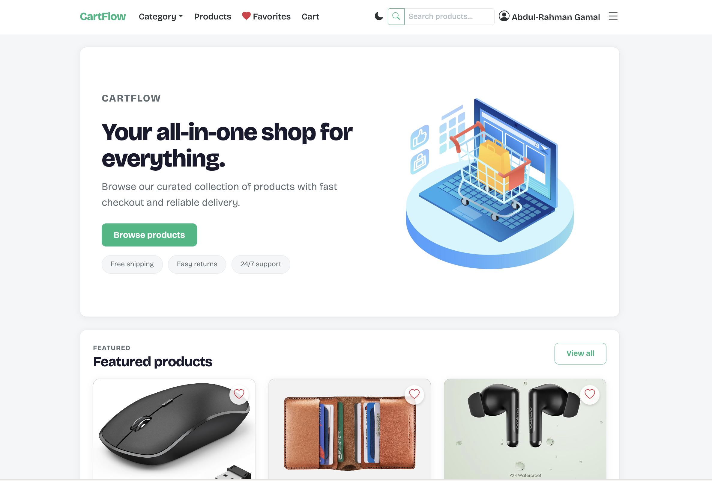
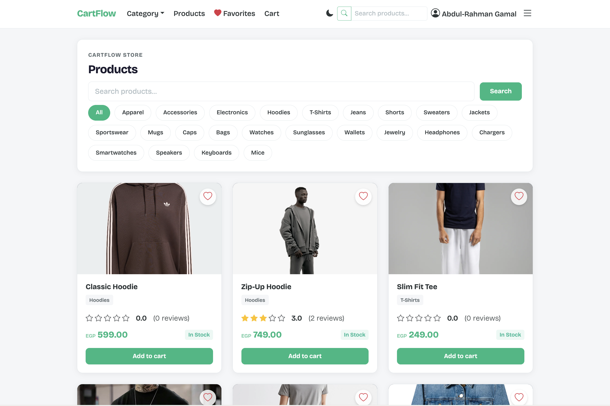
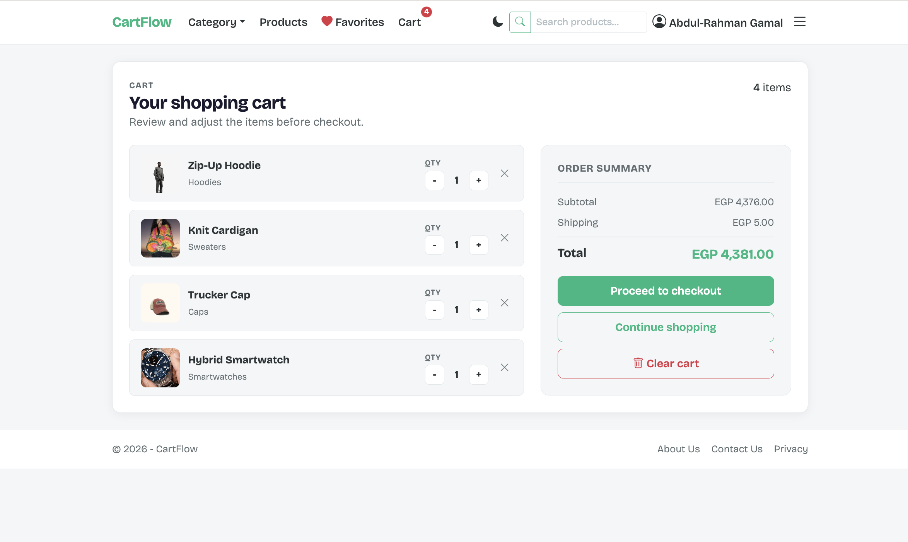
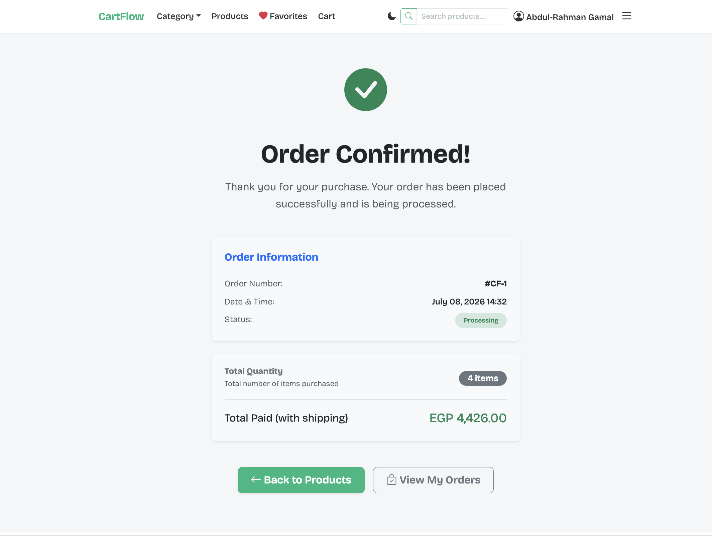

# CartFlow

> A full-featured e-commerce web application built with ASP.NET Core 10, Entity Framework Core, and SQL Server.  
> Developed as a DEPI graduation project.

[](https://dotnet.microsoft.com)
[](LICENSE)

---

## Table of Contents

- [Tech Stack](#tech-stack)
- [Features](#features)
- [Screenshots](#screenshots)
- [Getting Started](#getting-started)
  - [Prerequisites](#prerequisites)
  - [Setup](#setup)
  - [Demo Credentials](#demo-credentials)
  - [Stripe Test Mode](#stripe-test-mode)
- [Project Structure](#project-structure)
- [Deployment](#deployment)

---

## Tech Stack

| Layer        | Technology                          |
|-------------|--------------------------------------|
| Backend      | ASP.NET Core 10 (MVC)               |
| ORM          | Entity Framework Core 10             |
| Database     | SQL Server (Docker / LocalDB)       |
| Payments     | Stripe (test mode)                   |
| Auth         | Cookie-based authentication          |
| Frontend     | Razor Views, Bootstrap 5, CSS vars   |
| Container    | Docker (SQL Server image)            |

---

## Features

- **User Management** - registration, login, profile management
- **Product Catalog** - category filtering, search, image galleries with thumbnails
- **Shopping Cart** - guest session cart merges into DB cart on login
- **Checkout** - seamless Stripe payment integration
- **Product Reviews** - star ratings with comments, DB-backed
- **Order Management** - order history with details
- **Favorites** - cookie-based wishlist for logged-in and guest users
- **Responsive Design** - mobile-friendly layout with dark/light theme toggle

---

## Screenshots

| Home Page | Products Page |
|---|---|
|  |  |

| Cart Page | Confirmation Page |
|---|---|
|  |  |

---

## Getting Started

### Prerequisites

- [.NET 10 SDK](https://dotnet.microsoft.com/download/dotnet/10.0)
- Stripe test API keys ([get them free](https://dashboard.stripe.com/test/apikeys))

### Setup

#### macOS

**1. Clone the repository**

```bash
git clone https://github.com/4bdurahmann/ecommerce-app.git
cd ecommerce-app
```

**2. Start SQL Server (Docker)**

```bash
docker run -e "ACCEPT_EULA=Y" \
           -e "SA_PASSWORD=your_password" \
           -p 1433:1433 \
           -d mcr.microsoft.com/mssql/server:2022-latest
```

**3. Set the connection string**

```bash
dotnet user-secrets set "ConnectionStrings:constr" "Server=localhost,1433;Database=CartFlow;User Id=sa;Password=your_password;TrustServerCertificate=True;Encrypt=False"
```

**4. Configure Stripe keys**

```bash
dotnet user-secrets set "StripeKeys:SecretKey" "sk_test_your_secret_key"
dotnet user-secrets set "StripeKeys:PublishableKey" "pk_test_your_publishable_key"
```

**5. Run the application**

```bash
cd CartFlow.Web
dotnet run
```

#### Windows (LocalDB)

**1. Clone the repository**

```powershell
git clone https://github.com/4bdurahmann/ecommerce-app.git
cd ecommerce-app
```

**2. Install LocalDB** (if not already installed)

LocalDB ships with Visual Studio and SQL Server Express.  
Verify it's available:

```powershell
sqllocaldb info
```

If not installed, download [SQL Server Express](https://go.microsoft.com/fwlink/?linkid=866658) and select **LocalDB** during setup.

**3. Set the connection string**

```powershell
dotnet user-secrets set "ConnectionStrings:constr" "Server=(localdb)\MSSQLLocalDB;Database=CartFlow;Integrated Security=SSPI;TrustServerCertificate=True"
```

**4. Configure Stripe keys**

```powershell
dotnet user-secrets set "StripeKeys:SecretKey" "sk_test_your_secret_key"
dotnet user-secrets set "StripeKeys:PublishableKey" "pk_test_your_publishable_key"
```

**5. Run the application**

```powershell
cd CartFlow.Web
dotnet run
```

The application seeds the database automatically on first launch with:
- 15 categories (with subcategories)
- 40 sample products (with matched images)
- A test user account

### Demo Credentials

| Field    | Value                |
|----------|----------------------|
| Email    | ahmed@example.com    |
| Password | 123456               |

### Stripe Test Mode

Use the following test card for payments:

| Field         | Value                  |
|---------------|------------------------|
| Card Number   | `4242 4242 4242 4242` |
| Expiry        | Any future date        |
| CVC           | Any 3 digits           |

---

## Project Structure

```
ecommerce-app/
├── CartFlow.Web/             - ASP.NET MVC application
│   ├── Controllers/          - Request handlers
│   ├── Views/                - Razor UI templates
│   ├── Models/               - View models
│   └── wwwroot/              - Static assets (CSS, JS, images)
├── CartFlow.Services/        - Business logic & DTOs
│   ├── Interfaces/           - Service contracts
│   ├── Models/               - Data transfer objects
│   └── Services/             - Implementations
├── CartFlow.Data/            - Data layer
│   ├── Data/                 - DbContext & configurations
│   ├── Entities/             - Domain models
│   └── Migrations/           - EF Core schema migrations
└── CartFlow.sln              - Solution file
```

---

## Deployment

### FTP Deployment (Windows Hosting - MonsterASP.net, etc.)

```bash
dotnet publish CartFlow.Web -c Release -o ./publish
```

Upload the entire `publish/` directory to your server's web root via FTP.  
The server automatically detects the ASP.NET Core app via the generated `web.config`.
